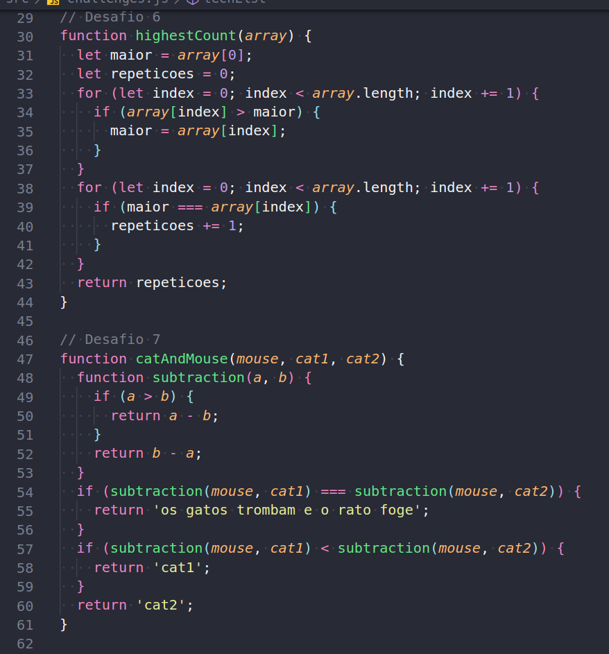

# project-playground-functions

## Sobre o Projeto

Projeto que realizei na Trybe, seu objetivo era fixar o conteúdo de javaScript,  exercitar a lógica de programação e buscar novos conhecimentos sobre a linguagem.

Lembro de quando eu fiz esse projeto e achei desafiador, tive um pouco de dificuldade em alguns requisitos, mas também achei divertido, porque uma coisa muito da hora é pensar, tentar executar, errar, tentar de novo e ver o código funcionando.

## Construido Com:
 1. **JavaScript**

## Contato

Renan Fernandes - [Linkedin](https://www.linkedin.com/in/orenanfernandes/)
